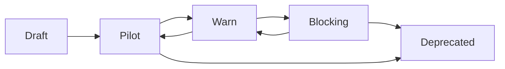

# Research Velocity Function

## Purpose
Continuous rule improvement based on real-world incidents, CVEs, and ecosystem changes.

## Roles

### Rule Author (Initially: Lead Architect)
**Cadence:** Biweekly review  
**Inputs:**
- Customer incident reports
- GitHub changelog (Actions, security advisories)
- CVE feeds (NVD, GitHub Security Lab)
- Community feedback (issues, discussions)

**Outputs:**
- Candidate rule specifications (MD-XXX draft)
- False positive analysis
- Severity calibration proposals

### Steward
**Cadence:** Monthly  
**Responsibilities:**
- Review candidate rules
- Promote/demote rules based on FPR data
- Approve rule version bumps
- Merge approved rules to registry

### Release Manager
**Cadence:** Quarterly (minimum)  
**Deliverables:**
- ≥2 new Tier B rules OR major rule revisions
- Release notes with upgrade guidance
- Updated documentation

## Rule Lifecycle



### Promotion Criteria

**Draft → Pilot:**
- Specification complete (detection logic, evidence, remediation)
- Unit tests passing
- Author approval

**Pilot → Warn:**
- Deployed to ≥3 pilot repos
- FPR ≤5% over 30 days
- No critical bugs

**Warn → Blocking:**
- Window ≥200 events
- FPR ≤0.5%
- ≥14 days in warn status
- Steward + security lead approval

**Demotion (any → lower):**
- FPR exceeds threshold
- Critical bug discovered
- Rule obsoleted by upstream fix

## Metrics

| Metric | Target | Measurement |
|--------|--------|-------------|
| Rule release rate | ≥2/quarter | GitHub releases |
| Pilot → Warn conversion | ≥70% | Registry transitions |
| FPR breach incidents | ≤1/quarter | Auto-demotion count |
| Community contributions | ≥1/year | External PR acceptance |

## Current State (as of 2026-01-31)

**Tier A Rules:** 5 (MD-001 through MD-005) - All in warn status  
**Tier B Rules:** 0 (planned: MD-100, MD-101, MD-102)  
**Rule Author:** Lead Architect  
**Steward:** TBD (assign by Day 21)  
**Next Release:** Q2 2026 (target: 3 Tier B rules)

## Process

### Biweekly Review Template
```markdown
## Review Date: YYYY-MM-DD

### Incidents Reviewed
- [INCIDENT-123] False positive in MD-002 (unpinned binary detection)
- [CVE-2024-XXXXX] New GitHub Actions vulnerability

### Candidate Rules
- **MD-006:** Detect OIDC token permission escalation
  - Priority: High
  - Complexity: Medium
  - Estimated FPR: <2%

### FPR Analysis
- MD-001: 0.3% (within threshold ✅)
- MD-004: 1.2% (monitor, near ceiling ⚠️)

### Actions
- [ ] Draft MD-006 specification
- [ ] Investigate MD-004 FP spike (repo: example/high-traffic)
```

### Quarterly Release Checklist
- [ ] ≥2 new rules OR major revisions shipped
- [ ] All rules have promotion evidence documented
- [ ] Changelog published
- [ ] Docs updated (examples, ADRs if needed)
- [ ] Community announcement (blog, GitHub discussion)

## Rule Development Workflow

1. **Identify Need:** Security incident, CVE, or community request
2. **Draft Specification:** Create MD-XXX.md in `docs/rules/`
3. **Implement Detection:** Add rule to `packages/mirror-dissonance/src/rules/`
4. **Unit Tests:** Achieve >90% code coverage
5. **Pilot Deployment:** Deploy to 3-5 internal repos
6. **Monitor FPR:** Track for 30 days, must be ≤5%
7. **Promote to Warn:** Public release, non-blocking
8. **Collect Data:** Gather ≥200 events over ≥14 days
9. **Final Review:** FPR ≤0.5%, security lead approval
10. **Promote to Blocking:** Rule becomes enforcing

## FPR Threshold Policy

| Rule Status | Max FPR | Window Size | Action on Breach |
|-------------|---------|-------------|------------------|
| Pilot | 5% | ≥10 events | Extend pilot or redesign |
| Warn | 1% | ≥50 events | Demote to pilot or disable |
| Blocking | 0.5% | ≥200 events | Auto-demote to warn |

## Community Contributions

We welcome community rule proposals! See `CONTRIBUTING.md` for:
- Rule proposal template
- Evidence requirements
- Acceptance criteria
- Credit and attribution policy

## Governance Integration

This research velocity function is governed by:
- Technical Steering Committee (TSC) for strategic direction
- Security Working Group for threat modeling
- Community feedback via GitHub Discussions
- Monthly public review meetings (see calendar)
